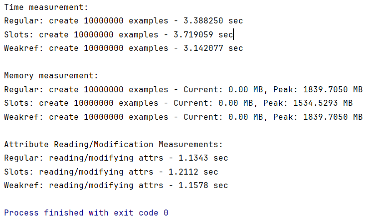

# Замеры скорости в `memory_profiler.py`

На скриншоте видно распределение по скорости, использованных способов:
1) Слабая ссылка с помощью `weakref`
2) Дефолтное создание экземпляров класса
3) Использование магического метода `__slots__`.

Распределение по памяти выглядит иначе:
1) `__slots__`
2) Обыкновенный способ
3) Слабые ссылки

*Получены ожидаемые результаты, однако для оптимизации параметр `numbers=1` и профилирование показывает время с некой незначительной погрешностью, тк машина выполняет код по-разному.*

